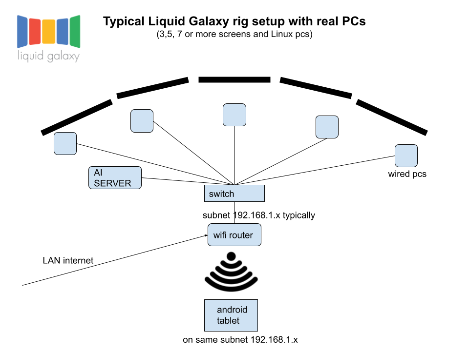

## Overview
Liquid Galaxy is a remarkable panoramic system that is tremendously compelling. It started off as a Google 20% project created by Google engineer Jason Holt to run Google Earth across a cluster of PCs and it has grown from there!

Liquid Galaxy hardware consists of 3 or more computers driving multiple displays, usually one computer for each display.

## Master/Slave Architecture
Liquid Galaxy applications have been developed using a master/slave architecture. The view orientation of each slave display is configured in reference to the view of the master display.

Navigation on the system is done from the master instance and the location on the master is broadcast to the slaves over UDP. The slave instances, knowing their own locations in reference to the master, then change their views accordingly.

The Liquid Galaxy Project, while making use of Google Earth software, does not develop the Google Earth codebase itself. Google Earth is not open source software, although it is free. Instead, the Liquid Galaxy Project works on extending the Liquid Galaxy system with open source software, both improving its administration and enabling open source applications, so that content of various types can be displayed in the immersive panoramic environment.

### Master
1. The central controlling entity that initiates commands and manages the overall operation.
2. It has the authority to issue commands and make decisions.
3. Examples: In a network, a central server controlling client devices; in a database system, a primary server managing replicas.

### Slave
1. Devices or processes that operate under the control and direction of the master.
2. They perform tasks assigned by the master and respond to its commands.
3. Examples: Networked devices (slaves) responding to commands from a central server; replica databases synchronized with the primary database.
