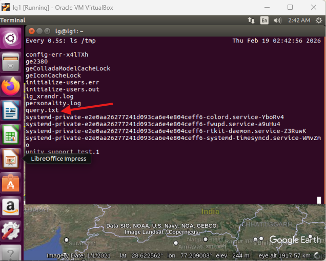

Basic Folder Structure Used in Liquid Galaxy Setup
==================================================

1️⃣ Introduction
----------------

Liquid Galaxy runs on a cluster of machines, and like any Linux-based system, it follows a structured folder organization. Understanding the folder structure is important for contributors because most setup scripts, configuration files, and development work happen inside specific directories.

In this entry i explain the basic folder structure commonly used in a Liquid Galaxy setup and highlights the directories that contributors interact with most frequently.

Which Part of LG This Belongs To
--------------------------------

This topic belongs to the Rig Side of Liquid Galaxy because it deals with the system environment and file organization inside the cluster machines.

2️⃣ Simplified Liquid Galaxy Folder Structure
---------------------------------------------

A Liquid Galaxy node contains important folders such as:

```
/home/lg
├── bin/ → LG operational scripts (relaunch earth, sync scripts, etc.)
├── scripts/ → contributor or custom scripts
├── kml/ → stored or generated KML overlays (if used)
└── logs/ → local debug outputs (optional)

/tmp
└── query.txt → temporary command file used by Google Earth

/etc → system configuration files
/var/log → system and service logs
/usr → installed system programs and utilities

```

3️⃣ Home Directory and Contributor Workspace
--------------------------------------------

After connecting to a Liquid Galaxy node using SSH:

```
ssh lg@<IP_ADDRESS>

```

you normally land in:

```
/home/lg

```

This is the primary working directory for contributors.

Typical uses:

*   Testing commands safely
*   Running scripts for visualization
*   Storing temporary KML files
*   Executing SSH-based commands from apps

Most development experiments should happen here rather than in system folders.

After SSH login, the default directory is usually /home/lg, which is the main contributor workspace.

4️⃣ Important Liquid Galaxy Script Locations
--------------------------------------------

Liquid Galaxy includes internal operational scripts, usually stored in:

```
/home/lg/bin/

```

For example:

```
/home/lg/bin/lg-relaunch-earth.sh

```

This script restarts Google Earth across nodes and reloads synchronization settings.

Some scripts or applications may also write commands into:

```
/tmp/query.txt

```

Google Earth monitors this file and reacts to instructions such as FlyTo commands or loading KML overlays.

Knowing these locations helps contributors understand where LG operations are triggered and where to look while debugging.

  

Figure 2: /tmp/query.txt file used by Liquid Galaxy for command execution.

5️⃣ Why Understanding Folder Structure Is Important
---------------------------------------------------

Knowing the folder structure helps contributors:

*   Avoid modifying critical system files
*   Keep scripts organized
*   Troubleshoot errors using log files
*   Work safely within the correct directories

6️⃣ Conclusion
--------------

Liquid Galaxy follows the standard Linux folder structure, but contributors mainly interact with a few critical locations such as the home directory, temporary command files like /tmp/query.txt, and directories storing KML overlays.

Understanding the basic folder structure in Liquid Galaxy makes it easier to navigate the rig and perform development tasks safely. While most work is done in the home directory, being aware of system folders like /etc/ and /var/ helps contributors better understand how the rig operates.
