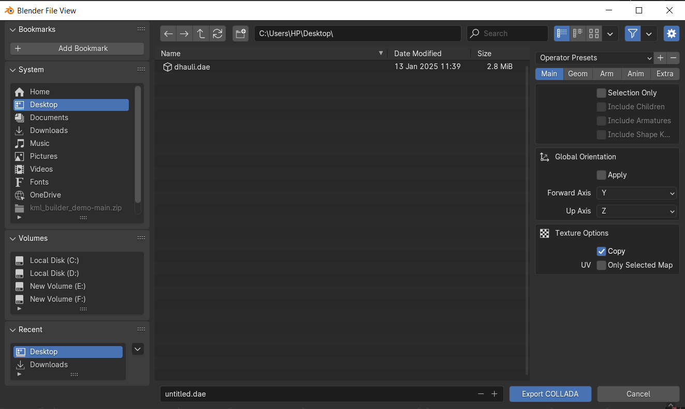
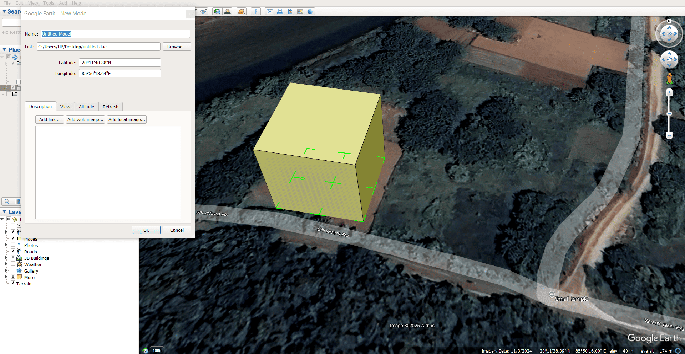
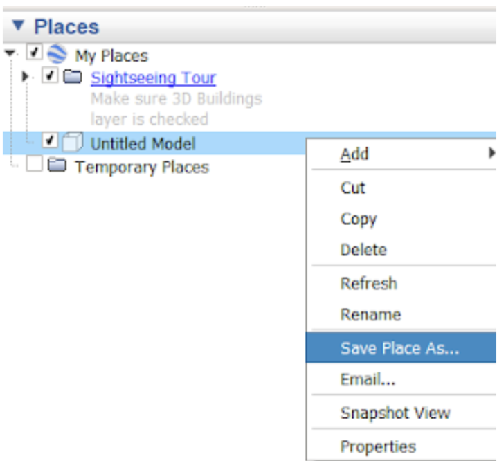

Three-dimensional KMLs elevate the sense of visualization by showing architectural marvels, historical monuments, buildings, and other structures on the Liquid Galaxy rig. Blender is an open-source software for creating 3D models using various shapes, colors, and textures. To achieve our visualizations, the Blender model can be converted to the KMZ format.

* * *

Exporting 3D model as **.dae** file from Blender
------------------------------------------------

Step 1 - Open the Blender file in which you have created the 3D model.

Step 2 - Ensure your model is correctly scaled and positioned above the XY plane.

Step 3(_Optional_) - If you have created custom textures, **Bake** them into PNG image files available under **Render Properties** tab in the Properties panel. Replace each texture with an image texture using its respective baked texture image.

Step 4 - Select the model and go to **File > Export > Collada (.dae)**.

Step 5 - In the Export settings window, check **Copy** and **Apply Modifiers** to create the highest-quality 3D renders with the correct textures.

Step 6 - Choose a destination folder and click Export COLLADA. 

Now, our **.dae** file is ready to be placed on Google Earth.

* * *

Converting the .dae File to a KML File using Google Earth Pro
-------------------------------------------------------------

Step 1 - Open Google Earth Pro.

Step 2 - Go to **File > Open** and browse your .dae file.

Step 3 - Select your desired file and click **Open**.

Step 4 - Position the model correctly:

*   Adjust the **Latitude**, **Longitude**, and **Altitude** settings to place it in the desired location.
    
*   Use the +(**Move**), ⬦(**Rotate**), and Γ(**Scale**) tools to adjust the position, orientation, and size of your 3D model, respectively. 
    

Step 5 - Once the model is positioned, click **OK**.

Step 6 - Right-click on the model in the **Places panel** and select **Save Place As..**.

Step 7 - Choose **KML (.kml)** as the format and save it.

* * *

Converting the .dae File to a KMZ File
--------------------------------------

Bring your .kml, .dae, and .png texture files to the same location and compress them into a ZIP file. Rename **.zip** to **.kmz**.

Finally, your KMZ file is ready to be displayed on the Earth.
