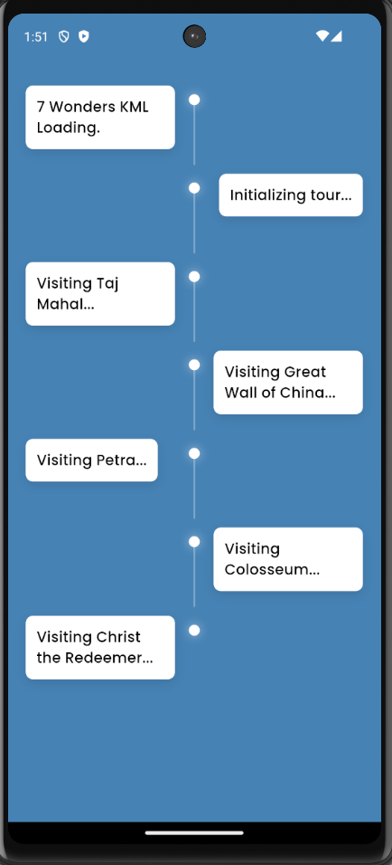

---
title: Creating a KML Tour Visualization Screen in Flutter
contributor: Arindam Bera
date: March 20, 2025
---

Implementation of a KML tour visualization screen in Flutter, integrating a timeline feature to display tour progress.

### Step 1 : Modifying the KML for Tour Control

To enhance the tour control, the KML file is updated with an `<ExtendedData>` tag that defines a `wait_duration`. This value represents the sum of duration of the `<gx:FlyTo>` animation and the subsequent `<gx:Wait>` duration.

```xml
        <gx:FlyTo>
          <gx:duration>5.0</gx:duration>
          <gx:flyToMode>bounce</gx:flyToMode>
          <LookAt>
            <longitude>78.0418727</longitude>
            <latitude>27.1744287</latitude>
            <altitude>182.0789411</altitude>
            <heading>0.0323890</heading>
            <tilt>61.9010861</tilt>
            <range>538.5527982</range>
          </LookAt>
        </gx:FlyTo>
        <gx:Wait>
          <gx:duration>6.0</gx:duration>
        </gx:Wait>
        <Placemark>
          <name>Taj Mahal</name>
          <ExtendedData>
            <Data name="wait_duration">
              <value>11.0</value>
            </Data>
          </ExtendedData>
          <Point><coordinates>78.0421323,27.1750488,0</coordinates></Point>
        </Placemark>

```

### Step 2: Parsing the KML before sending to Liquid Galaxy

Before uploading the KML file, the data is parsed to extract the names and wait durations for timeline synchronization. This ensures the UI reflects the tour's progress accurately.

```dart
for (var placemark in placemarks) {
        final nameElement = placemark.findElements('name').first;
        final name = nameElement.text;
        final extendedData = placemark.findElements('ExtendedData');
        final waitDurationElement = extendedData
            .expand((data) => data.findElements('Data'))
            .where((data) => data.getAttribute('name') == 'wait_duration')
            .map((data) => data.findElements('value').first.text)
            .firstOrNull;


        final waitDuration = waitDurationElement != null
            ? double.tryParse(waitDurationElement) ?? 5.0
            : 5.0;


        tourStops.add({'name': name, 'duration': waitDuration});
      }


      for (var stop in tourStops) {
        context.read<TimelineBloc>().add(
              AddTimelineStep(step: "Visiting ${stop['name']}..."),
            );
        await Future.delayed(Duration(seconds: stop['duration'].toInt()));
      }

```

### Step 3: Handling the Timeline with a Timeline Bloc

The TimelineBloc is responsible for tracking and updating the timeline progress. The CurrentTimelineState class stores the timeline steps. The AddTimelineStep adds a new step or place into the timeline .

### Add Timeline Step Event :

```dart
class AddTimelineStep extends TimelineEvent {
  final String step;
  AddTimelineStep({required this.step});
}
```

### Timeline State Class :

```dart
class CurrentTimelineState extends TimelineState {
  final List<String> timelineSteps;
  final int currentStepIndex;


  CurrentTimelineState({
    required this.timelineSteps,
    required this.currentStepIndex,
  });


  double get progress => timelineSteps.isEmpty ?
    0.0 : (currentStepIndex + 1) / timelineSteps.length;
}

```

### TimelineBloc Event Handler :

```dart
 on<AddTimelineStep>((event, emit) {
      final currentState = state as CurrentTimelineState;
      final updatedSteps =       
 List<String>.from(currentState.timelineSteps)
        ..add(event.step);
     
      emit(CurrentTimelineState(
        timelineSteps: updatedSteps,
        currentStepIndex: updatedSteps.length - 1,
      ));
    });

```

This ensures each new step or placemark name is added to the timeline as the tour progresses.

### Step 4: Displaying the Tour in UI

In the UI, the timeline updates in sync with the KML tour progress.

```dart
builder: (context, state) {
              if (state is CurrentTimelineState) {
                return SafeArea(
                  child: Column(
                    
                children: [
                      Expanded(
                        child: ListView.builder(
                          controller:
                              _scrollController,
                          padding: EdgeInsets.only(top: 20.h),
                          itemCount: state.timelineSteps.length,
                          itemBuilder: (context, index) {
                            return TimelineItem(
                              isLeft: index.isEven,
                              stepText: state.timelineSteps[index],
                              isLast: index ==  
 state.timelineSteps.length - 1,
                              animationDelay:
                                  Duration(milliseconds: 200 * index),
                            );
                          },
                        ),
                      ),
                    ],
                  ),
                );
              }
              return const SizedBox();
            },
          ),


```

### User Interface



This approach integrates a dynamic KML tour visualization screen in Flutter. By adding a wait\_duration in KML, syncing the timeline UI with the tour enhances user engagement and provides clear progress tracking. This implementation is efficient, scalable, and follows best practices for Bloc state management.
