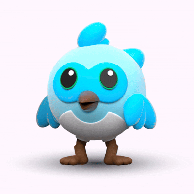
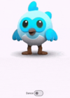

---
title: Creating Animated Icons in Flutter using Rive
contributor: Shuvam Swapnil Dash
date: February 27, 2025
---

Animation is essential for creating a responsive and interactive UI in Flutter applications. Animated icons improve the user and overall experience while surfing the application. Rive is a powerful tool for adding vector animations in Flutter, enabling smooth, real-time animations controlled by user interactions or predefined logic.

* * *

### Rive

Rive is a real-time, interactive design tool that allows developers to create and control animations directly within Flutter. Unlike GIFs or Lottie animations, Rive provides more flexibility and interactivity through state machines.

### _Getting Started_

First, we need to add the following dependency into our `pubspec.yaml`:

`qr_code_scanner_plus: ^2.0.10+1`

### _Loading the Animation File_

We have the option to either directly paste the rive file link and use it(using network) or download the file locally and store it in our assets folder(using asset):

```
RiveAnimation.network('https://public.rive.app/community/runtime-files/2191-4327-loader-solicitud-de-cuentas.riv')

```
```
RiveAnimation.asset('assets/dash_flutter_mascot.riv')

```

### _Let’s Code_

This is a simple implementation of both trigger and boolean animations:

```
class _HomeState extends State<Home> {
 Artboard? riveArtboard;
 SMIBool? isDance;
 SMITrigger? isLookUp;


 @override
 void initState() {
   super.initState();
   rootBundle.load('assets/dash_flutter_mascot.riv').then(
         (data) async {
       try {
         final file = RiveFile.import(data);
         final artboard = file.mainArtboard;
         var controller =
         StateMachineController.fromArtboard(artboard, 'birb');
         if (controller != null) {
           artboard.addController(controller);
           isDance = controller.findSMI('dance');
           isLookUp = controller.findSMI('look up');
         }
         setState(() => riveArtboard = artboard);
       } catch (e) {
         print(e);
       }
     },
   );
 }


 @override
 Widget build(BuildContext context) {
   return Scaffold(
     body: riveArtboard == null
         ? const SizedBox()
         : Column(
       children: [
         Expanded(
           child:
           GestureDetector(
             child: Rive(
               artboard: riveArtboard!,
             ),
             onTap: (){
               isLookUp?.value = true;
             },
           ),
         ),
         Row(
           mainAxisAlignment: MainAxisAlignment.center,
           crossAxisAlignment: CrossAxisAlignment.center,
           children: [
             Text('Dance'),
             Switch(
               value: isDance!.value,
               onChanged: (value) => {setState(() => isDance!.value = value)},
             ),
           ],
         ),
         const SizedBox(height: 50),
       ],
     ),
   );
 }
}

```

### _Code Explanation_

The 4 major components which control the animation are:

*   **Artboard**: It holds the main Rive animation instance to be displayed.
*   **State Machine Controller**: It Manages the animation's state transitions and interactions.
*   **SMITrigger**(isLookUp): It can be thought of as a bool that resets to false itself automatically. This class is used to read and create an instance of Trigger input.



When we tap on the icon, the boolean value of isLookUp is set to true. This activates the ‘look up’ animation and turns false itself after a short duration, usually after the animation has completed one loop. Thereafter, the animation stops until it is clicked again.

*   **SMIBool(isDance)**: This is used to get and used to control Bool input.



When we turn on the switch, the isDance variable is set to true, but it stays intact. The animation starts and repeats in an infinite loop until we manually change the variable to false(by turning off the switch in this case).

* * *

### _Conclusion_

Rive is a vast community with millions of animations for various app and web development uses. Its [website](https://rive.app/) is a must-visit for inspiration.
