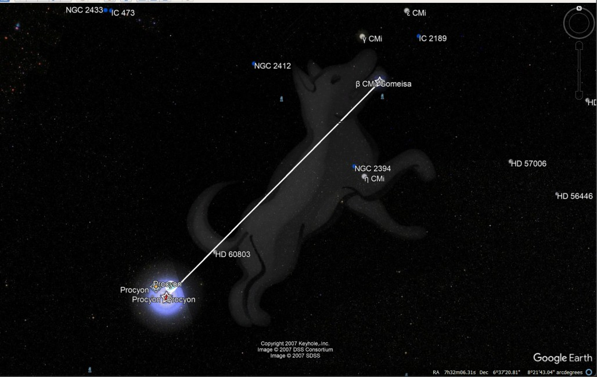

## Overview
Creating Constellation Visualizations in LG Sky View Using KML Files
====================================================================

This guide provides step-by-step instructions for creating KML files to display constellations in LG Sky View. The KML file contains celestial data such as stars, constellations, and other astronomical objects.

Step 1: Preparing the KML File
------------------------------

1.  **Create a new KML File**: Start by creating a new file with a `.kml` extension. Example: `canis_minor.kml`
    
2.  **Add the Sky Mode Hint**: Include the `hint="target=sky"` attribute inside the `<kml>` element to indicate that this KML file is for sky data.
    
    ```xml
    <?xml version="1.0" encoding="UTF-8"?>
    <kml xmlns="http://www.opengis.net/kml/2.2" hint="target=sky">
    <Document>
    ```

Step 2: Adding Constellation Image Overlay
------------------------------------------

To display an image of the constellation:

1.  Use the `<GroundOverlay>` element.
2.  Set the image URL with the `<href>` tag.
3.  Define the image position with `<LatLonBox>`.

Example:

```xml
<GroundOverlay>
  <name>Canis Minor Image</name>
  <Icon>
        <href>http://maps.google.com/mapfiles/kml/shapes/star.png</href>
  </Icon>
  <color>4CFFFFFF</color> <!-- 30% visible -->
  <LatLonBox>
    <north>8.5</north>
    <south>5.0</south>
    <east>-65.0</east>
    <west>-69.0</west>
    <rotation>-20</rotation>
  </LatLonBox>
</GroundOverlay>
```

Step 3: Marking Stars
---------------------

Add key stars in the constellation using the `<Placemark>` element with coordinates.

Example:

```xml
<Placemark>
  <name>Procyon</name>
  <Point>
    <coordinates>-65.174502,5.224988</coordinates>
  </Point>
</Placemark>
```

Step 4: Connecting Stars with Lines
-----------------------------------

Use the `<LineString>` element to draw lines between stars.

Example:

```xml
<Placemark>
  <name>Line: Procyon to Gomeisa</name>
  <LineString>
<tessellate>1</tessellate>
    <altitudeMode>absolute</altitudeMode>
    <coordinates>
      -65.174502,5.224988
      -68.212208,8.289417
    </coordinates>
  </LineString>
</Placemark>
```

Step 5: Saving and Viewing the File
-----------------------------------

1.  Save the file with a `.kml` extension.
2.  Open Google Earth or Liquid Galaxy and load the KML file.
3.  Switch to Sky mode in Google Earth to view the constellations.



By following these steps, you can create beautiful constellation visualizations in LG Sky View.
