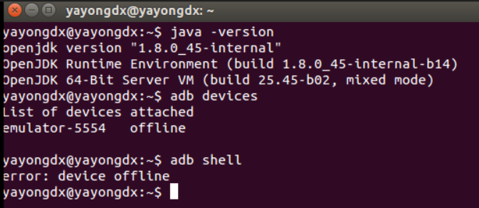
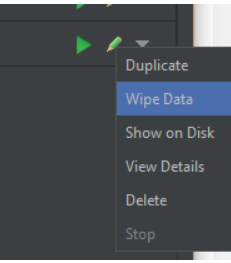
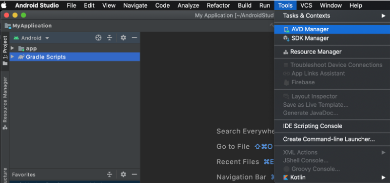

* * *

* * *

1\. Problem Overview
--------------------

When using Android Studio, especially on older hardware, the Android Emulator may display a black screen and fail to load the application.

Even after multiple configuration changes and updates to:

*   Android Studio
*   Emulator images
*   System settings

the issue may persist.

### Common Symptoms

*   Emulator device shown as **offline**
*   Timeout errors while waiting for the emulator to come online
*   Application never launches
*   Kernel panic messages in logs

* * *

2\. Environment Details
-----------------------

The issue is observed under the following environments:

### Operating Systems

*   Windows
*   Ubuntu

### Android Studio Version

*   Android Studio 4.1.2

### Hardware Setup

*   Older AMD processors (e.g., A8-3870 APU)
*   Limited RAM and CPU resources

* * *

3\. Common Debugging Attempts
-----------------------------

Users typically try the following before identifying the root cause:

### 3.1 Virtualization Check

*   Confirm virtualization is enabled in BIOS.
*   Ensure hardware acceleration is properly configured.

### 3.2 Emulator Configuration Changes

*   Modify allocated RAM and CPU cores.
*   Switch between hardware and software rendering.
*   Adjust graphics settings.

### 3.3 Flutter and ADB Verification

*   Run `flutter doctor`
*   Run `adb devices`

Observed issues:

*   Conflicting device connection states.
*   Repeated emulator offline status.
*   Kernel panic errors in logs.

### 3.4 Wipe Emulator Data

In some cases, wiping emulator data resolves the issue.

If this does not work, follow the troubleshooting steps below.

* * *

Troubleshooting Steps
=====================

* * *

Step 1: Switch to ARM-Based Emulator Images
-------------------------------------------

Older AMD processors often struggle with x86 emulator images. ARM-based images tend to work more reliably on such hardware.

### Why This Works

x86 images depend heavily on hardware virtualization and may perform poorly or fail on unsupported or older CPUs.

### How to Switch

1.  Open **AVD Manager**
    *   Go to: `Tools > AVD Manager`

2.  Create a New Virtual Device
    
    *   Click **Create Virtual Device**
3.  Select an ARM-Based System Image
    
    *   Choose an ARM system image
    *   Avoid x86 images
4.  Configure Emulator Settings
    
    *   Finalize device configuration
    *   Click **Finish**

This typically resolves the black screen issue.

* * *

Step 2: Optimize Performance on Older Hardware
----------------------------------------------

Switching to an ARM-based image may fix the boot issue, but performance may still be slow.

### 2.1 Adjust Emulator Resource Allocation

*   Limit CPU cores assigned to the emulator.
*   Reduce RAM allocation to improve responsiveness.
*   Avoid over-allocating system resources.

### 2.2 Use Cold Boot Every Time

\[This worked for me personally as of Feb 2026\]

*   Enable **Cold Boot** instead of Quick Boot.
*   This prevents startup state corruption and emulator glitches.
*   Frequently resolves repeated boot failures.

* * *
