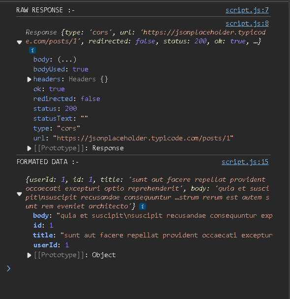

---
title: Fetching and Displaying API Data Using JavaScript
contributor: Taha Sadikot
date: January 6, 2025
---

Fetching Data from APIs
=======================

The below image is the content of my JavaScript code file to fetch data from APIs and display that data on my HTML page. In the HTML file, I have two buttons with IDs `load-data` and `clear-data` to fetch data and clear data from the HTML file dynamically.

```javascript
document.addEventListener("DOMContentLoaded", function () {
    document.getElementById("load-data").addEventListener("click", async function () {
      alert("DATA BEING LOADED !!!");
  
      try {
        const response = await fetch("https://jsonplaceholder.typicode.com/posts/1");
        console.log("RAW RESPONSE :- \n")
        console.log(response)
        if (!response.ok) {
          throw new Error('Network response was not ok');
        }
        const data = await response.json();

        document.getElementById("display-data").innerHTML = "Title :- " + data.title + "<br>" + "Data :- " + data.body;
        console.log('FORMATED DATA :-\n', data);
      } catch (error) {
        console.error('Error:', error);
      }
    });

    document.getElementById("clear-data").addEventListener("click", function () {
        alert("DATA BEING CLEARED !!!");
        document.getElementById("display-data").innerHTML = "";
      });

  });

```

JavaScript Functionality
------------------------

### **1\. `DOMContentLoaded` Event**

*   The JavaScript code waits for the DOM to fully load before attaching event listeners to the buttons.
*   This is also useful if you include the script file in the `<head>` section instead of at the end of the `<body>` tag in the HTML file.

### **2\. Fetching Data**

*   When the **Load Data** button is clicked, an alert is shown, and the `fetch` API is used to retrieve data from `https://jsonplaceholder.typicode.com/posts/1`.
*   The response is checked for errors using `response.ok`.
*   The JSON data is parsed using `response.json()` and displayed in the `display-data` div.

### **3\. Clearing Data**

*   When the **Clear Data** button is clicked, the content of the `display-data` div is cleared.

### **4\. Error Handling**

*   Errors (e.g., network issues, invalid responses) are caught and logged to the console.


----------------------------------------------------------------------------------------------------------------------------------------------------------------

Raw Response vs Formatted Response
----------------------------------

The below image shows the content of the **raw response object** received and the **formatted response object** after using the `.json()` method.

*   **Raw Response**: Allows the user to check the status of the response and other related attributes.
*   **Formatted Response**: After using the `.json()` method, it removes all other information and allows the user to access the main content of the data received as the body of the API response.

* * *

Sending Data to APIs
====================

```javascript
document
    .getElementById("connect-btn")
    .addEventListener("click", async function () {
      const ip = document.getElementById("ip").value;
      const username = document.getElementById("username").value;
      const password = document.getElementById("password").value;
      if (ip && username && password) {
        try {
          // Send a test command to the backend
          const response = await fetch("/check-connection", {
            method: "POST",
            headers: { "Content-Type": "application/json" },
            body: JSON.stringify({ ip, username, password }),
          });

          const result = await response.json();
          if (result.success) {
            document.getElementById("status").textContent = "Master Node Ready";
            document.getElementById("status").style.color = "green";
          } else {
            document.getElementById(
              "status"
            ).textContent = `Error: ${result.error}`;
            document.getElementById("status").style.color = "red";
          }
        } catch (error) {
          document.getElementById("status").textContent = "Connection Failed";
          document.getElementById("status").style.color = "red";
        }
      } else {
        document.getElementById("status").textContent = "Invalid Input";
        document.getElementById("status").style.color = "red";
      }
    });
```

The above image is of a JavaScript function to send data to a server running on the backend to connect with Liquid Galaxy on a web application.

*   In this `fetch` request, along with the API URL, you have to set `method = POST` to indicate that the request is intended to send data to the specified URL.
*   The data to be sent is specified in the `body` of the request, as shown in the code above.
*   The rest of the handling process is the same as shown in the fetching data process.

* * *
