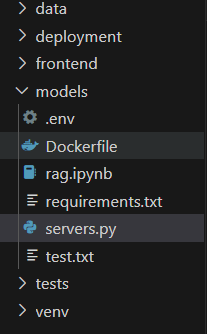

How to create your own Dockerfile
=================================

* * *

STEP 1: Make a file named “Dockerfile” You need to create a base file first, on which it will be automatically identified by Docker as the “Dockerfile”. By Default, the file named “Dockerfile” is automatically taken as a Dockerfile (do not tamper or edit the extension)



STEP 2: Open the file and write the code to set the base image Now type and use the “FROM” keyword to define the starting point for your container.

```docker
FROM ubuntu:20.04
```

You can choose from official images like ubuntu, node, python, alpine, etc.

STEP 3: Now define the working directory Now type and use the “WORKDIR” keyword which defines the container inside the container where commands will run.

```docker
WORKDIR /app
```

NOTE: This sets /app as the working directory inside the container.

STEP 4: Install the necessary dependencies Now type and use the “RUN” keyword to retrieve all the dependencies or software needed by the application in the container

```docker
RUN apt-get update && apt-get install -y curl
```

NOTE: You can install multiple packages by chaining commands.

STEP 5: Copy files into the container Now type and use the “COPY” keyword to copy the files from your local machine into the container.

```docker
COPY . /app
```

This copies all files from the current directory (.) into /app in the container.

STEP 6: Now expose the port Now type and use the keyword “EXPOSE” that defines which ports the container will use for communication.

```docker
EXPOSE 80
```

The above exposes port 80 (typically for web apps)

STEP 7: Set the environmental variables Now set the environmental variables with help of the “ENV”

```docker
ENV NODE_ENV=production
```

The above helps with configuration, like setting the environment to "production".

STEP 8: Define the start command Use “CMD” or “ENTRYPOINT” to specify the command to run where the container starts.

```docker
CMD ["python", "app.py"]
```

NOTE: CMD can be overridden, while ENTRYPOINT is fixed.

STEP 9: Now that your dockerfile is ready, build the image and then run the container with the following commands: BUILD THE IMAGE:

```bash
docker build -t my-sample-app .
```

RUN THE CONTAINER:

```bash
docker run -p 80:80 my-sample-app
```

Example of a sample Dockerfile: (Refer to the directory structure in the first image)

```docker
# Use a Python base image
FROM python:3.10-slim

# Set the working directory in the container
WORKDIR /app

# Copy the requirements file into the container
COPY requirements.txt .

# Install dependencies
RUN pip install --no-cache-dir -r requirements.txt

# Copy the rest of your application code into the container
COPY . .

# Expose the port that FastAPI will run on
EXPOSE 80

# Set the command to run the FastAPI application with uvicorn
CMD ["uvicorn", "servers:app", "--host", "0.0.0.0", "--port", "80"]
```
