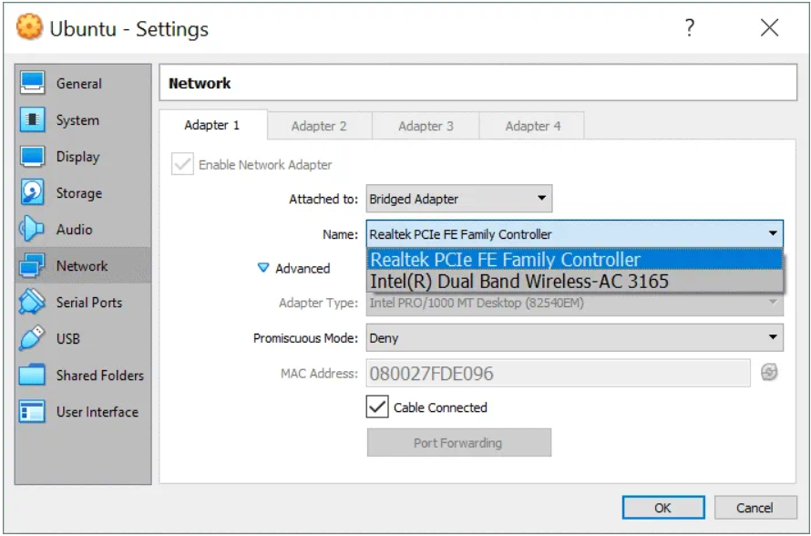
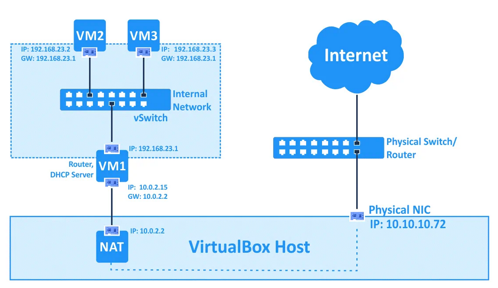
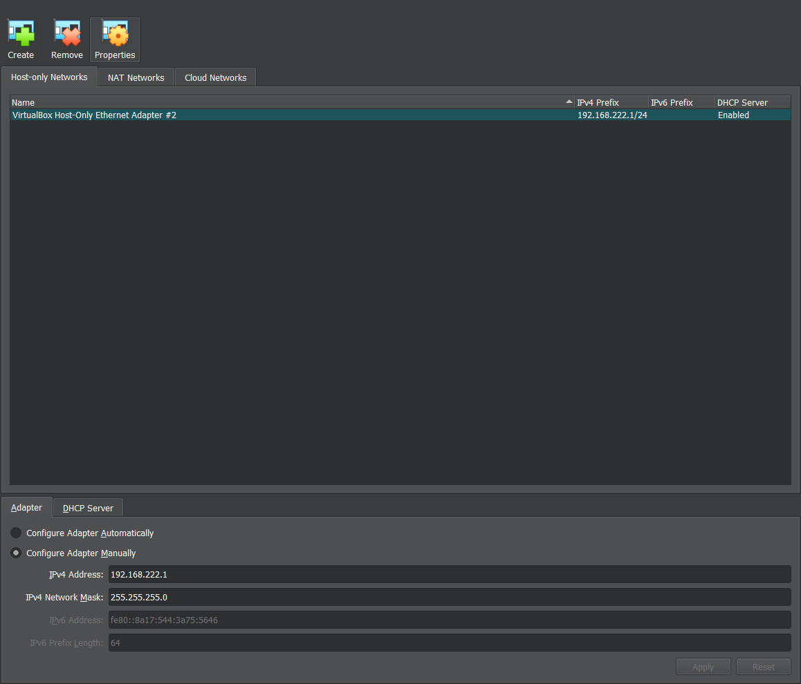
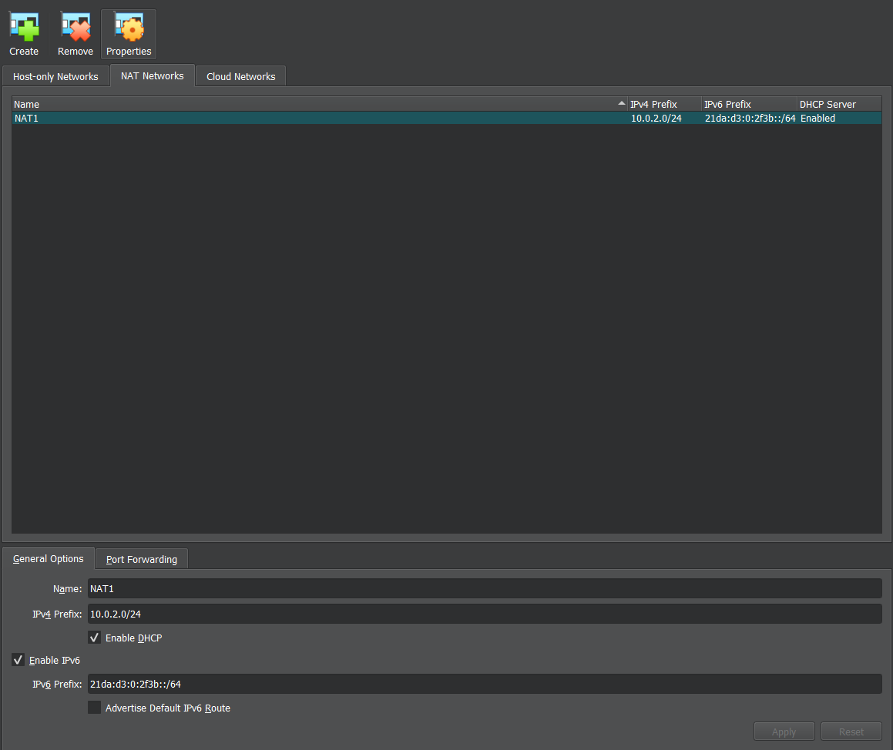

---
title: How to use different virtual network modes to connect to LG rig
contributor: Tathagat Kumar
date: March 1, 2025
---
## Overview
How to use different virtual network modes to connect to LG rig
===============================================================

* * *

Most of us generally use of NAT network when it comes to connecting the LG rig. This documentation aims to make use of different virtual network modes and offer more choices as follows:

1.  Bridged adapter: This network mode can be used to run servers on VMs that must be fully accessible from a physical local area network (used to connect to physical devices). When using the bridged network mode in VirtualBox, you can access a host machine, hosts of the physical network and external networks, including internet from a VM. The VM can be accessed from the host machine and from other hosts (and VMs) connected to the physical network.

 If your host machine has multiple physical network adapters, make sure to choose the appropriate one in the VirtualBox network settings. The screenshot below shows two physical network adapters – an Ethernet adapter and a Wi-Fi adapter. When using bridged mode with a wireless network adapter, the guest operating system won't be able to utilize advanced features of the Wi-Fi adapter, such as selecting Wi-Fi networks or enabling monitoring mode. Instead, you'll need to connect to the Wi-Fi network from the host machine.

2.  Internal Network: This network can be used to connect VMs with each other. Such a network can be used to substitute the connection between the master and the slave in the LG rig when operating locally. VMs on this network can communicate with each other, but they are unable to interact with the VirtualBox host machine, other devices on the physical network, or any external networks. Additionally, VMs connected to the internal network cannot be accessed by the host or any other devices. The VirtualBox internal network is ideal for simulating real networks. For instance, you can set up three VMs, each with a virtual network adapter (Adapter 1) connected to the internal network. The IP addresses for these network adapters will be assigned from the subnet designated for the VirtualBox internal network (which you need to define manually). One of the VMs (VM1) will also have a second virtual network adapter set to operate in NAT mode. VM1 will be configured as a router (while using Linux and configuring IPTABLES is an ideal solution for setting up a router, simpler routing configurations can be used for initial VirtualBox network testing). 
    
3.  Host-only Adapter: This network mode enables communication between the host and its guest VMs. A virtual machine can interact with other VMs connected to the host-only network, as well as with the host machine itself. Additionally, the host machine has access to all VMs that are connected to the host-only network.  In Host-Only mode, the virtual network adapters of the VMs do not have a gateway configured in their IP settings, as this mode restricts connections to devices outside of the host-only network. You can also create multiple host-only network adapters in VirtualBox to set up different isolated networks—just click the "Create" button. If a host-only network is no longer required, you can easily remove it by selecting the corresponding adapter and clicking "Remove" button.
    
4.  NAT network: When using the NAT Network mode for multiple virtual machines, they can communicate with each other over the network. The VMs can also access other devices on the physical network as well as external networks, including the internet. However, machines from external networks, or from the physical network to which the host is connected, cannot reach the VMs in NAT Network mode (much like how a home router prevents external access to devices on the local network). Additionally, you cannot directly access the guest machines from the host unless port forwarding is set up through VirtualBox's global network settings. The VirtualBox NAT router uses the host's physical network interface as the external interface, similar to the behavior in NAT mode. 
