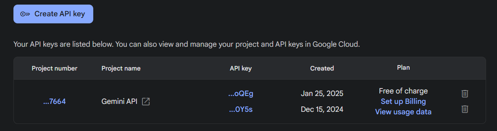

---
title: Integrating Gemini AI into Web Application
contributor: Karan Kumar Das
date: April 11, 2025
---

Integrating Gemini AI into Web Application
==========================================

Introduction
------------

The rapid advancements in AI models, such as Google’s Gemini, OpenAI’s GPT, and others, have opened up new possibilities for enhancing web applications. By integrating these models, developers can introduce features like natural language understanding, chatbot functionality, and intelligent recommendations, significantly improving the overall user experience. This entry explores how to integrate Gemini, or similar AI models, into a web application using only frontend technologies.

Understanding the Role of AI in a Web App
-----------------------------------------

AI models can be integrated into web apps for:

*   **Conversational AI** – Implementing chatbots or virtual assistants.
*   **Content Generation** – Auto-generating text, summaries, or code.
*   **Intelligent Search** – Enhancing search capabilities with AI-driven context understanding.
*   **Data Analysis** – Processing user inputs and providing insights based on AI.

Tech Stack and Prerequisites
----------------------------

Before diving into integration, here’s what you’ll need:

*   **Languages & Frameworks**: JavaScript, React.js or any other JS framework for UI.
*   **API Handling**: Axios (for making HTTP requests)
*   **Basic Knowledge of**: Frontend development, API calls, and handling responses

Step-by-Step Process of Integration
-----------------------------------

### 1\. Obtain a Gemini API Key

To use Google’s Gemini AI API, follow these steps:

*   Go to [Google AI Studio](https://aistudio.google.com) and sign in with your Google account.
*   Click on **Get API key** and generate a new key by clicking on **Create API key**.
*   Copy and store the key securely and avoid exposing it in public repositories. 

### 2\. Implement the API Call in the Frontend

The frontend will directly interact with the Gemini API to fetch responses.

```js
import axios from 'axios';

const GEMINI_API_KEY = "YOUR_GEMINI_API_KEY";

const fetchResponse = async () => {
    const input = "Hello Gemini!";

    try {
        const response = await axios({
            url: `https://generativelanguage.googleapis.com/v1beta/models/gemini-2.0-flash:generateContent?key=${GEMINI_API_KEY}`,
            method: "post",
            headers: {
                'Content-Type': 'application/json'
            },
            data: {
                contents: [
                    { parts: [{ text: input }] }
                ],
            },
        });

        const geminiResponse = response.data.candidates[0].content.parts[0].text;
        console.log(geminiResponse);
    } catch (error) {
        console.error('Error fetching response from API:', error);
    }
};
```

Conclusion
----------

Integrating Gemini AI into a web app is a straightforward process when working with just the frontend. By following the step-by-step approach, you can easily implement AI based functionalities without setting up a backend. However, if you want more flexibility, you can explore other AI models like OpenAI’s GPT or Hugging Face models. Depending on your tech preferences, you can use different frontend frameworks, API methods, and deployment options. Ensuring secure API key handling and optimizing the frontend will help create a better user experience. Additionally, you can fine-tune the model according to your needs by referring to the API documentation.
