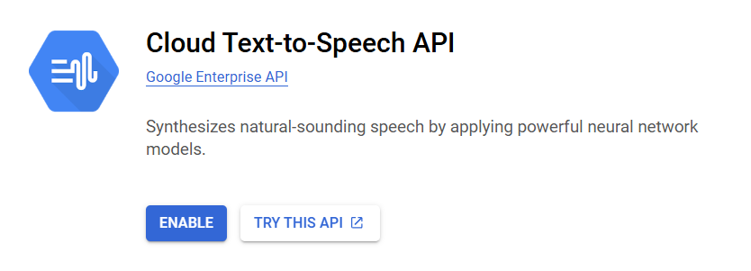
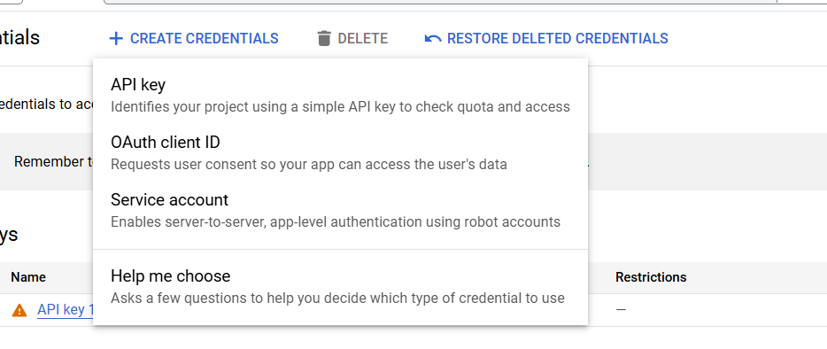
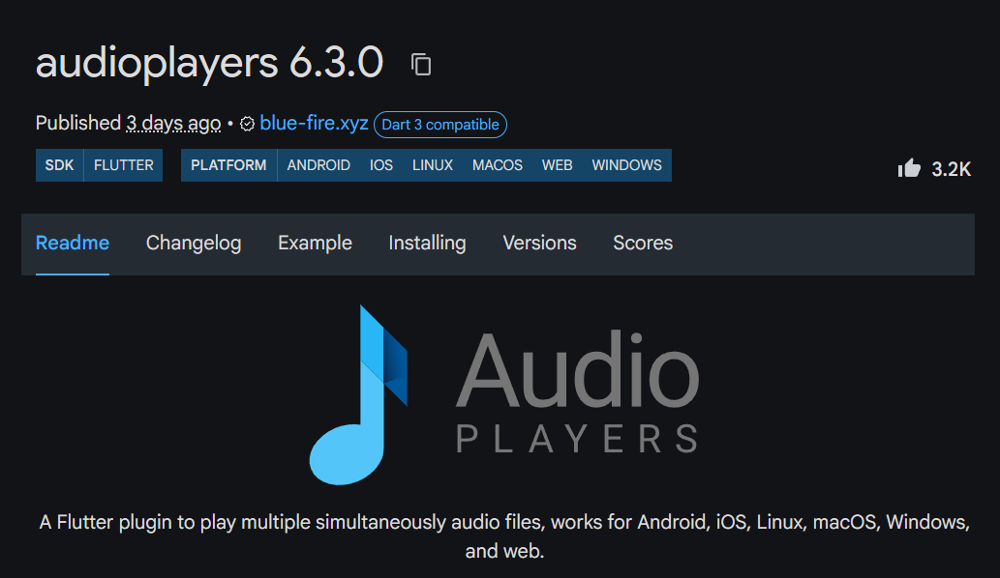

---
title: Integrating Text-to-Speech (TTS) in Flutter Applications
contributor: Arindam Bera
date: March 20, 2025
---

Text-to-Speech (TTS) is a powerful technology that converts text into natural-sounding speech.

Ways to implement TTS in flutter-

### 1\. Using flutter\_tts Package

Add this dependency to your pubspec.yaml file

```yaml
flutter_tts: ^4.2.2
```

Implementation: Import the flutter\_tts package and create a method to use text to speech.

```dart
class _TTSExampleState extends State<TTSExample> {
  final FlutterTts _flutterTts = FlutterTts();


  Future<void> _speak(String text) async {
    await _flutterTts.setLanguage("en-US");
    await _flutterTts.setPitch(1.0);
    await _flutterTts.setSpeechRate(0.5);
    await _flutterTts.speak(text);
  }


 
 @override
  Widget build(BuildContext context) {
    return Scaffold(
      appBar: AppBar(title: const Text("TTS Example")),
      body: Center(
        child: ElevatedButton(
          onPressed: () => _speak("Hello! This is a Flutter Text-to-Speech demo."),
          child: const Text("Speak"),
        ),
      ),
    );
  }
}


```

You can also select different voices through this package for that you have to use:

```dart
void getVoices() async {
    List<dynamic> voices = await _flutterTts.getVoices;
    for (var voice in voices) {
      print(voice);
    }
    await _flutterTts
        .setVoice({"name": "en-us-x-sfg#female_2-local", "locale": "en-US"});
  }

```

The \_flutterTts.getVoices will return a list of voice that you can use.

### 2\. Using Google Cloud Text-to-Speech API

Google Cloud Text-to-Speech offers high-quality and realistic-sounding voices.

Enable Cloud Text-to-Speech API on your Google Cloud account.



Generate an API key for authentication.



Use the http package to send requests.

```dart
Future<void> googleTTS(String text) async {
  const apiKey = 'YOUR_GOOGLE_CLOUD_API_KEY';
  const url = 'https://texttospeech.googleapis.com/v1/text:synthesize?key=$apiKey';


  
final response = await http.post(
    Uri.parse(url),
    headers: {'Content-Type': 'application/json'},
    body: jsonEncode({
      "input": {"text": text},
      "voice": {"languageCode": "en-US", "name": "en-US-Wavenet-D"},
      "audioConfig": {"audioEncoding": "MP3"}
    }),
  );


  final responseBody = jsonDecode(response.body);
  final audioContent = responseBody['audioContent'];
}

```

Now once you get the audioContent you can use packages like audioplayers: ^6.3.0 to play the audioContent directly in your flutter app.


