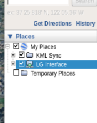

The Problem
-----------

When creating KML scripts or testing dynamic `gx:Tours` sent from a Flutter or BlueStacks controller app, contributors frequently encounter a scenario where the KML is successfully sent to the rig, but nothing renders on the displays.

At this stage, identifying the root cause is difficult. The failure typically stems from one of two possibilities:

1.  **Syntax Errors:** The KML code contains errors (such as an unclosed XML tag). This is easily identified in static KMLs but significantly harder to spot during dynamic generation.
2.  **Network Delivery Failure:** The network delivery system such as the `NetworkLink` or the HTTP server has failed. This is often the most difficult issue to diagnose.

The Step-by-Step Verification Workaround
----------------------------------------

To determine if your KML code is structurally sound, you can bypass the network entirely by manually loading the file into Google Earth Pro on the Master node and, subsequently, the slave nodes.

## Manual Verification Steps:

1.  **Open Google Earth Pro:** Launch the application on your master node.
2.  **Enable Sidebar:** Ensure the left-hand sidebar is visible. If hidden, press `Ctrl+Alt+B` or navigate to **View > Sidebar**.
3.  **Load the File:** Go to **File > Open (Ctrl+O)** and select your `.kml` file, or simply drag and drop the file into the main viewing window.
4.  **Locate in Places:** Look at the **Places** panel on the left. Your file will initially appear under the **Temporary Places** folder.
5.  **Save to My Places:** Right-click your newly loaded file and select **"Save to My Places"** from the context menu.
6.  **Activate Layers:** Ensure the checkbox next to the filename is ticked.
7.  **Final Save:** Go to **File > Save > Save My Places**.

**The Result:** If your KML renders perfectly after these steps, you have successfully proven that your KML syntax is correct. The bug, therefore, exists within your server setup or your `NetworkLink` update interval.

> Strict Note: **Do not use this for "Final Deployment":**

It is critical to understand that this is strictly a debugging tool. You must never rely on "My Places" for an actual Liquid Galaxy Task submission. Files stored in the local "My Places" directory exist only on that specific machine. Because they bypass the programmatic `NetworkLink` architecture, they will not trigger the UDP `ViewSync` broadcast packets. Consequently, the Master screen will display your KML, but the Slave screens will remain blank and out of sync. Once you verify the code works, delete it from **My Places** and fix your network script for the final deployment.
