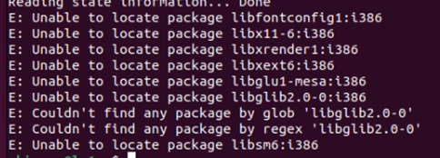
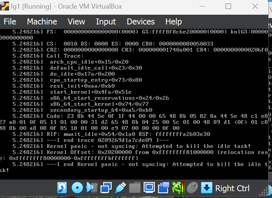
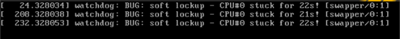
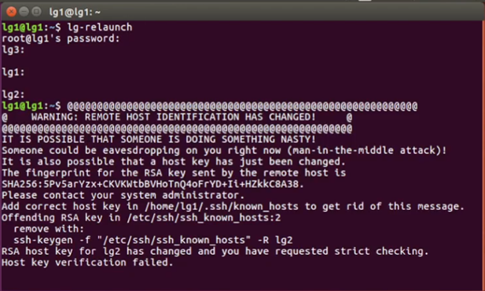
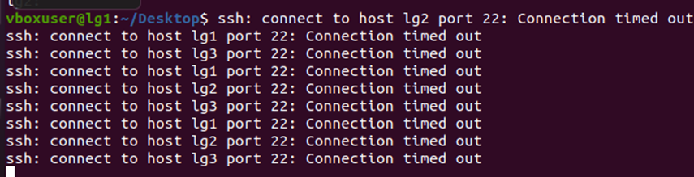

---
title: Liquid Galaxy Virtual Setup Problems & solutions
contributor: Mahinour
date: March 18, 2024
---
## Overview
Problem-1
=========

*   **Issue**: Google Earth launches on Master, but not on the slaves or one of the slaves.
*   **Reason-1**: Network error during LG setup
    *   **Solution-1**:
        *   Try `lg-relaunch` command on the master again and again.
        *   If that didn’t work, then there might have been an internet connection problem or a network error while the lg was being installed then do the following:
            *   Run the lg setup script again on the slave that had the problem and make sure you have good internet connection, then try relaunching again.
*   **Note**: ALWAYS HAVE A STABLE AND STRONG INTERNET CONNECTION DURING THE LG INSTALLATION PROCESS
*   **Reason-2**: You might have used an upgraded Ubuntu version.
    *   **Solution-2**: Make sure you have ubuntu version 16.04 with NO upgrades on all 3 VMs.

Problem 2
=========

*   **Issue**: Google Earth doesn’t start automatically on the MASTER
*   **Reason-1**: Something must have gone wrong during the installation of LG, or a network error.
    *   **Solution-1**: Redo the lg setup again with stable and strong internet connection.
    *   **Note**: ALWAYS HAVE A STABLE AND STRONG INTERNET CONNECTION DURING THE LG INSTALLATION PROCESS

Problem 3
=========

*   **Issue**: unable to locate package on VM
    
*   **Reason-1**: You might have used an upgraded Ubuntu version.
    
    *   **Solution-1**: Make sure you have ubuntu version 16.04 with NO upgrades on all 3 VMs.

Problem 4
=========

 

*   **Issue**: \[CPU stuck / end Kernel panic – not syncing: Attempted to kill the idle task!\] Errors on any of the VMs
    
*   **Reason-1**: VMs crashed due to too less or too many cores.
    
    *   **Solution-1**: Increase the cores, neither too low nor too high. In many cases 2 processor cores would be fine.
*   **Reason-2**: Issue with virtual box
    
    *   **Solution-2**: Try upgrading or downgrading your virtual box.

Problem 5
=========

*   **Issue**: Host Key verification failed on lg-relaunch
    
*   **Reason-1**: Slave machines are not connected with each other.
    
    *   **Solution-1**:
        *   Make sure they are all on the same network
        *   Setup NAT Network correctly
        *   You can also enable a network dedicated to host-only network.
        *   Redo the LG setup on the VMs

Problem 6
=========

*   **Issue**: connection timed out
    
*   **Solution-1**:
    
    *   Make sure you connected the masters and slave VMs to NAT network, not NAT
    *   Make sure your ISP hasn’t blocked port 22, try using different network connection like a hotspot

Problem 7
=========

*   **Issue**: Any of the VMs crashed or aborted
*   **Solution-1**: Increase cores.
*   **Solution-2**: Restart your laptop & virtual box
*   **Solution-3**: Enable/disable host-only network again (if the problem was on the master machine after creating a host-only network)

Random Tips:
------------

*   ALWAYS HAVE A STABLE AND STRONG INTERNET CONNECTION DURING THE LG INSTALLATION PROCESS because this is the main reason of 90% of the errors and crashes.
*   Make sure you have Ubuntu version 16.04.7 and NOT the upgraded version.
*   Make sure you have the latest version of virtual box installed.
*   Make sure you configure the (NAT Network), not NAT, correctly between the 3 VMs to allow them to communicate with each other and have access to the internet connection through the host which acts as the gateway.
*   Make sure you configure the host-only Network on the master machine to allow communication between the host and the master and accordingly the slaves.
*   Make sure the tablet or any physical device that will control the rig is on the same network (either wifi or hotspot) as your host machine.
*   Make sure you follow all documentation steps correctly and wisely.
