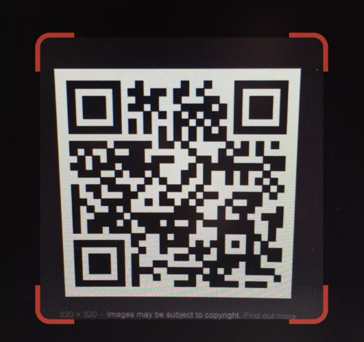

Quick-response (QR) code scanning has become an essential feature in modern-era mobile application development. Its use case extends from copying simple URLs into the clipboard to ticket verifications and initiating payments. Its simple yet important characteristic of scanning strings from the barcode can be exploited to read JSON objects and fill in text fields.

* * *

### _Getting Started_

First, we need to add the following dependency into our `pubspec.yaml`:

`qr_code_scanner_plus: ^2.0.10+1`

### _Let’s Code_

We will create a widget that captures the QR Code Scanner view:

```
class CameraWidget extends StatefulWidget {
 final GlobalKey qrKey;
 final QRViewCreatedCallback onQRViewCreated;
 const CameraWidget({super.key,required this.qrKey, required this.onQRViewCreated});


 @override
 State<CameraWidget> createState() => _CameraWidgetState();
}


class _CameraWidgetState extends State<CameraWidget> {
 @override
 Widget build(BuildContext context) {
   return Expanded(
     child: QRView(
       key: widget.qrKey,
       overlay: QrScannerOverlayShape(
         borderColor: Colors.red, borderRadius: 10, borderLength: 40,
         borderWidth: 10, cutOutSize: 250,
       ),
       onQRViewCreated: widget.onQRViewCreated,
     ),
   );
 }
}

```



We are going to initialize the QR code reader through a controller:

```
QRViewController? controller;

```

We will declare a couple of more variables to be used in the widget:

```
final GlobalKey qrKey = GlobalKey(debugLabel: 'QR');
Barcode? result;
bool isFlashOn = false;

```

To fetch the result of the scan, we use:

```
 _onQRViewCreated(QRViewController controller) {
   this.controller = controller;
   controller.scannedDataStream.listen((scanData) {
     setState(() {
       result = scanData;
	 print('Barcode Type: ${describeEnum(result!.format)} Data: ${result!.code}');


     });
   });
 }

```

To switch ON/OFF flash, we use:

```
 _flashToggle() async{
   if (controller != null) {
     await controller!.toggleFlash();
     bool? flashStatus = await controller!.getFlashStatus();
     setState(() {
       isFlashOn = flashStatus ?? false;
     });
   }
 }

```

To switch between the back and front camera, we use:

```
 _cameraSwitch() async{
   if (controller != null) {
     await controller!.flipCamera();
   }
 }

```

Then, we will design our QR Code Scanner screen by integrating the above widget with a row consisting of the buttons to toggle the flash and flip camera, one stacked on the other as follows:

```
 @override
 Widget build(BuildContext context) {
   return Scaffold(
     body: Stack(
       children: <Widget>[
         CameraWidget(qrKey: qrKey, onQRViewCreated: _onQRViewCreated),
     Positioned(
       top: 40,
       right: 20,
       child: Row(
         children: [
           IconButton(
             icon: Icon(
               isFlashOn ? Icons.flash_on : Icons.flash_off,
               color: Colors.white,
               size: 30,
             ),
             onPressed: () {
               _flashToggle();
             },
           ),
           SizedBox(width: 20,),
           IconButton(
             icon: Icon(
               CupertinoIcons.camera_rotate_fill,
               color: Colors.white,
               size: 30,
             ),
             onPressed: () {
               _cameraSwitch();
             },
           ),
         ],
       ),
     )
       ],
     ),
   );
 }

```


Finally, to integrate it into Android devices:

*   In android/build.gradle, change `ext.kotlin_version` to its latest version.
*   In android/gradle/wrapper/gradle-wrapper.properties change the `distributionUrl` to its latest version.

### _Code Explanation_

The **QRView** opens a camera screen to scan the QR code. This widget has an **overlay** section defining a rounded square region within the camera view. We place the QR code in this region and scan it on our mobile phones. The rest of the screen is usually blurred to provide focus. The overlay can be customized with various parameters, such as Cutout and Border sizes.

The boolean **isFlashOn** changes the flash icon based on whether it is ON or OFF. The controller variable is our main state variable. It tracks the **flash** and **camera** buttons and assigns the fetched value to the ‘result’ variable through the **\_onQRViewCreated** function. The barcode value returned from the ‘result’ variable can be decoded into a string as `'Barcode Type: ${describeEnum(result!.format)} Data: ${result!.code}'` where result!.format shows the type of the scanned barcode and result!.code fetches the necessary details/links associated with it. We can use the latter to visit URLs, read/copy text, manipulate JSON objects, etc.

* * *

### _Conclusion_

This is a simple implementation of a QR Code Scanner. It has several more camera-specific functions which can be discovered in its pub.dev page - [qr\_code\_scanner\_plus](https://pub.dev/packages/qr_code_scanner_plus).
