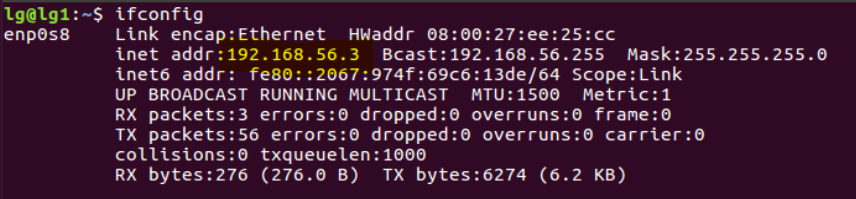
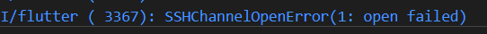
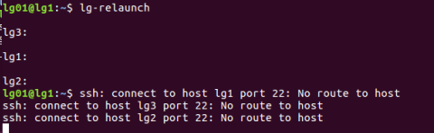
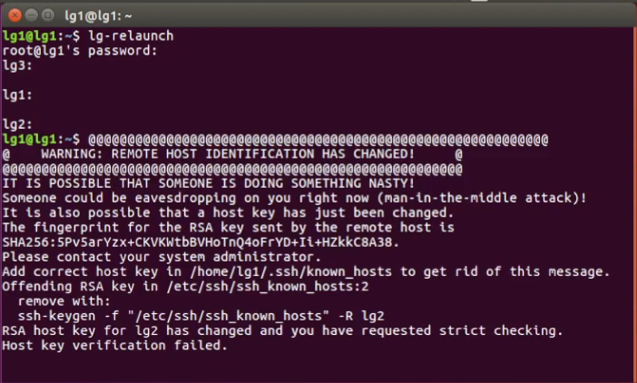
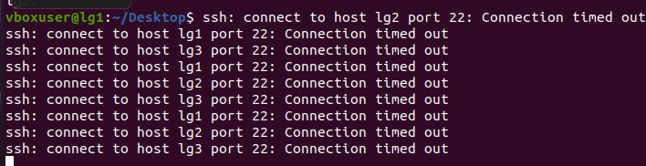

---
title: "Questions and Answers from the Discord\:"
contributor: Youssef khalid mahmoud
date: March 18, 2024
---

**Q1-** I can't find Liquid Galaxy controller app on play store ?  
**A-** You can use LVC-located voice CMS which functions in the same way.

**Q2-** How do I setup virtual machines for Liquid Galaxy?

**A-** First you will need to download Ubuntu ISO version 16.04 from [here](https://drive.google.com/file/d/1QwMDFWuutEt5Gs1KCvR5XDtkMOMfRqdP/view?usp=share_link). Then you can follow the manual [here](https://drive.google.com/file/d/1uwWEKms1ZHZoRjn4IKOchk71solLxpuL/view), along with this short and conscious installation tutorial made by wanna-be contributor Soham Jaiswal [here](https://www.youtube.com/watch?v=CLdUuDHo6lU).

**Q3-** How to start using integrating an application with Liquid Galaxy?

**A-** You can follow this tutorial by Mentor Vedant Singh as a start [here](https://www.youtube.com/watch?v=Dj26c3-Ha9A&t=4632s).

**Q4-** My APK is not connecting to the network even though it was working in debug mode.

**A-** You need to add user permission to the application in `AndroidManifest.xml` in the directory `android\app\src\main`. Add the line: `<uses-permission android:name="android.permission.ACCESS_NETWORK_STATE"/>`.

**Q5-** I wrote a KML that should make a picture appear over the map and I am sure the KML file is getting updated but I have to relaunch Liquid Galaxy for it to update.

**A6-** You have to go to the slave screen: `view->sidebar->expand KML sync->right click on Solo KML ->choose properties ->choose refresh ->change time passed Refresh to periodically 1 sec`.

**Q7-** I want to run a KML file on Google Earth?

**A-** Press `Ctrl+O` and choose the KML file.

**Q-8** The KML file I am is not being sent to Liquid Galaxy even though I was following the tutorial and the function was written correctly.

**A-** You have to use single quotes when sending the KML file like this example:

```dart
Future<SSHSession?> kmlLogo() async {
    final KML = '''
        Kml data
    ''';
    try {
        if (_client == null) {
            print('SSH client is not initialized.');
            return null;
        }
        final resultExct=await _client!.execute("echo '$KML' > /var/www/html/kml/slave_2.kml");
        print("chmod 777 /var/www/html/kml.txt; echo '$KML' > /var/www/html/kml/slave_2.kml");
        return resultExct;
    } catch (e) {
        print('An error occurred while executing the command: $e');
        return null;
    }
}
```

**Q9-** What KML file should I update to display an image on it?

**A-** The files you need will be in `var/www/html/kml` directory and the file name should be `slave_number.kml`.

**Q10-** How can I check the VM IP address that I should use when connecting to it with the app?

**A-** Type `ifconfig` in the terminal to view all the connections and IP address of the machine. 

**Q11-** When Google Earth launches the earth keeps rotating indefinitely, how can I stop it?

**A-** Go to `tools-> options -> reduce the fly to speed to 0 -> restore defaults -> ok`. You have to do this every time you relaunch the LG.

**Q12-** I am using a Liquid Galaxy app and it refuses to connect to the VM.

**A-** Try pinging the VM IP address of the VM from your computer, open terminal and type: `ping <ip address>`.

**Q13-** How do I know that Google Earth and Liquid Galaxy have been installed correctly?

**A-** Google Earth will launch by itself each time you reboot the machine.

**Q14-** After using a Liquid Galaxy app the app banner keeps appearing on the slave machine?

**A-** You have to use the Clean logo or Clean KML option from the Liquid Galaxy app settings as it will clean the KML files for the slaves and then relaunch LG.

**Q15-** `'echo "playtour=Orbit" > /tmp/query.txt'` I used this command to enable orbiting but it is not working?

**A-** You need to first send a KML that has the orbiting functionality, name it orbit and then run the command for it to work.

**Q16-** Google Earth is not launching by itself when I relaunch the VM?

**A-** You have to reinstall Liquid Galaxy from the start and be sure to have a stable internet connection. Also make sure that the firewall is disabled by using these commands:

```bash
sudo ufw disable
sudo iptables -F
```

**Q17-** I was wondering if anyone had this error before that disconnects the client,

**A-** Implement a `reconnectClient` function that gets called every 30 seconds while the app is running. 

**Q18-** I get an error message when trying to relaunch stating No route to host. How do I fix it?  **A-** Check if the username and password for each machine was the same in installation and check that you are using the command when all machines have finished starting up.

**Q19-** I keep getting this error when I relaunch Liquid Galaxy.  **A-** Slave machines are not connected with each other. Put them all on the same network. Also check for host-VM network setting. Setup NatNetwork correctly, you can also enable a network dedicated to host only network.

**Q20-** I keep getting connection timeout between the host and the slaves.



## A-

*   Make sure you connected masters and slave VMs to a NAT network, not NAT, which is used by default.
*   Make sure your ISP hasn't blocked port 22, try using different network connection like mobile data hotspot.

This Markdown text can be copied and pasted into a GitHub Markdown file.
