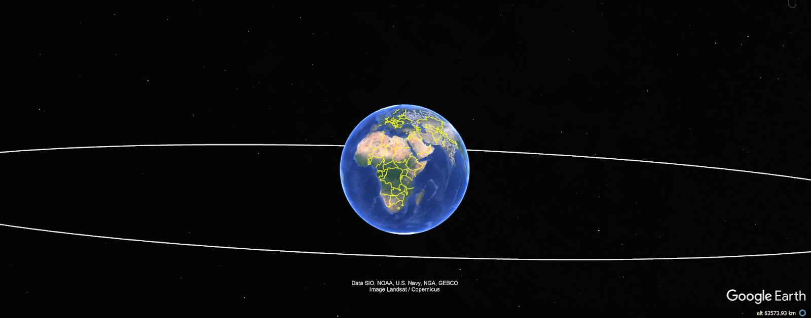
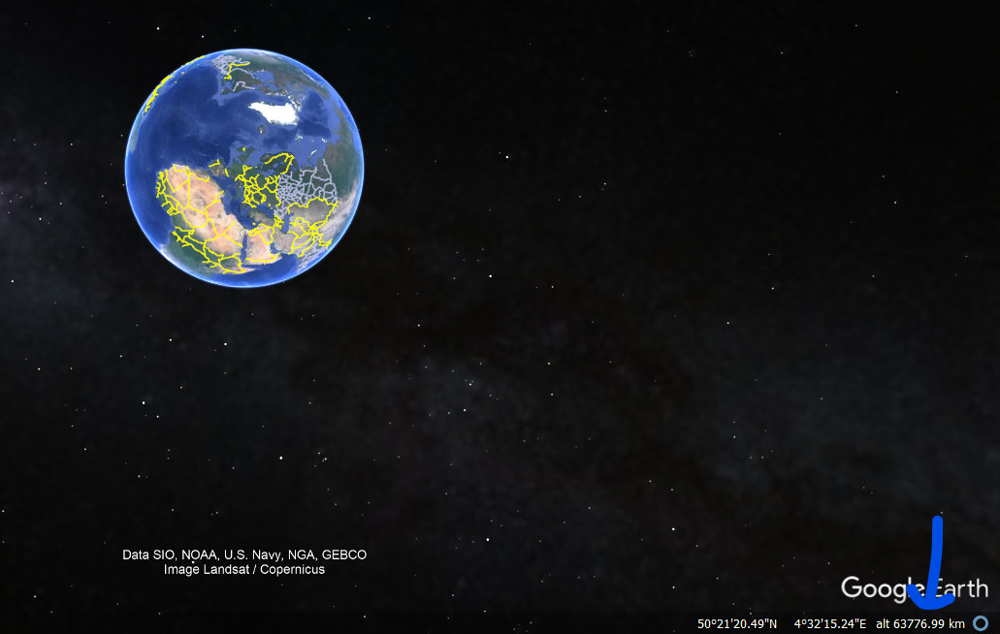
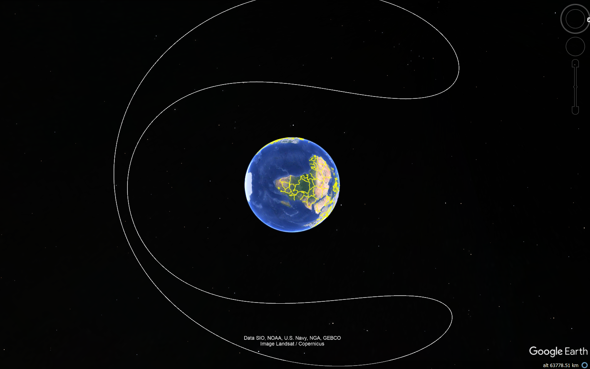
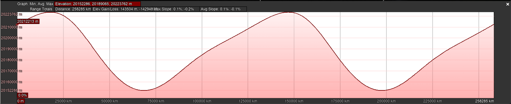
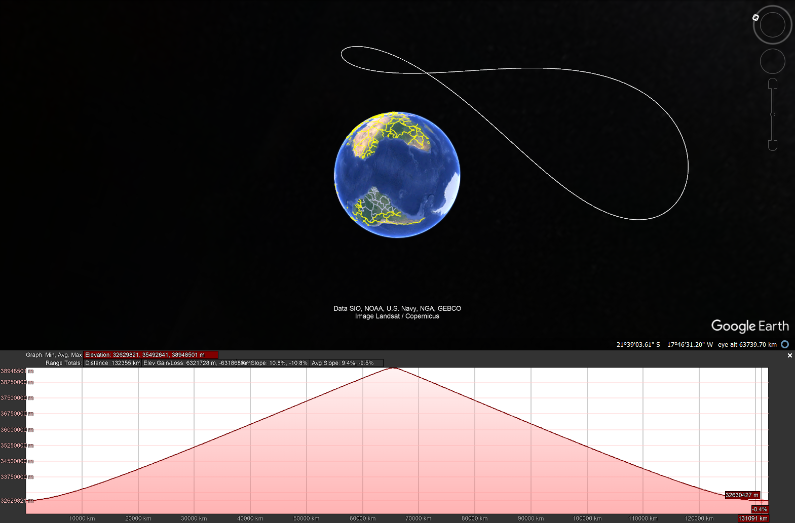

## Introduction
----------------

The aim of this research is to determine the feasibility of displaying orbits on Google Earth and to identify the altitude limitations for comfortable visualization.

## Representation
------------------

To represent the orbits, I utilized orbit data (TLE) obtained from N2YO.com. Subsequently, I generated KML files and uploaded them to Google Earth Pro 7.3.6.9750 (64-bit).

## Findings
------------

After some testing, I found out that the **maximum altitude** of an orbit displayed on Google Earth is **approximately** 36.000 km (~22.369 miles).

In this research all altitude values are considered **Absolute** type. Let's look at the Graveyard orbit below, which has an altitude of 36.050 km.

This limitation is due to the fact that the camera altitude in Google Earth cannot exceed 63,000 km natively. 

## Considerations
------------------

So now we understand that orbits can be represented at an altitude of approximately 36.000 km. It's important to keep in mind that this value may vary due to altitude changes during the orbit. Let's take the GPS orbit as an example:

The elevation profile illustrates variations in altitude over time.

## Another example (QZSS orbit)
--------------------------------

With that, we can represent all orbits in a realistic way (keeping in mind the altitude limits).[here](https://www.n2yo.com/satellite/?s=42965)
