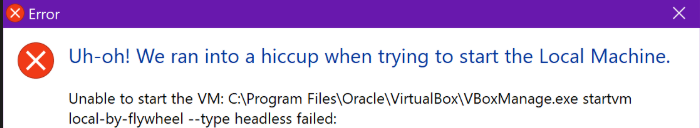

---
title: Resolving VirtualBox Launch Issues Caused by Windows Hypervisor Conflict
contributor: Harsh Mehta
date: March 1, 2026
---

VirtualBox Fails to Launch on Windows Due to Hypervisor Conflict
================================================================

VirtualBox is a widely used virtualization platform, but on Windows systems, it may fail to launch or install virtual machines when certain hypervisor-related features are active. This issue is especially common after enabling WSL2 (Windows Subsystem for Linux 2), which depends on the Windows Hypervisor.

* * *

* * *

When the Windows Hypervisor is active, it takes control of virtualization resources, preventing VirtualBox from accessing them. As a result, users may encounter errors such as:

*   Virtual machines failing to start
*   Inability to install new VMs
*   Crashes or freezes during VM initialization

This conflict is triggered by specific Windows features that rely on hypervisor-based virtualization.

* * *

Root Cause
----------

The following Windows features contribute to the conflict:

*   **Virtual Machine Platform**  
    Required by WSL2, but often the primary cause of VirtualBox launch failures.
    
*   **Windows Hypervisor Platform**  
    May also interfere with VirtualBox’s ability to access virtualization hardware.
    
*   **Windows Subsystem for Linux**  
    Rarely the direct cause, but disabling it may help in persistent cases.
    

These features enable Hyper-V components, which override the virtualization layer that VirtualBox depends on.

* * *

## A few fixes-
----------------

* * *

Step 1: Open Windows Features
-----------------------------

*   Press **Windows + S**
*   Search for **“Turn Windows features on or off”**
*   Click to open the Windows Features dialog

* * *

Step 2: Disable Conflicting Features
------------------------------------

Uncheck the following options:

*   Virtual Machine Platform
*   Windows Hypervisor Platform
*   (In some cases, you might also need to uncheck **Windows Subsystem for Linux**)

* * *

Step 3: Restart the System
--------------------------

After making changes, restart your computer to apply the configuration.

* * *

Step 4: Launch VirtualBox
-------------------------

Once restarted, open VirtualBox and try launching or installing your virtual machine. It should now initialize without errors.

* * *

5\. Optional: Switching Between WSL2 and VirtualBox
---------------------------------------------------

## Note:
If you use both WSL2 and VirtualBox regularly, you may need to toggle these features on and off depending on your current task.
