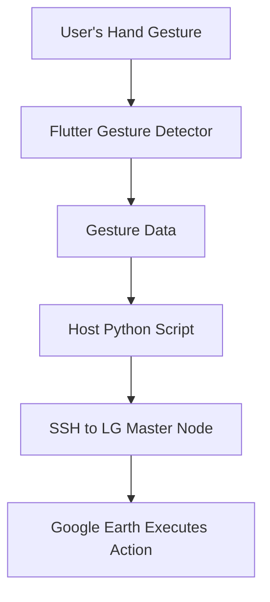

# Robotic Arm Gesture Control for Liquid Galaxy

## Overview

This project integrates a gesture-controlled robotic arm with the Liquid Galaxy system to enable touchless, intuitive control of virtual globes and visual content. Through predefined hand gestures, users can zoom, pan, and fly to locations on Google Earth running on Liquid Galaxy.

This interface enhances accessibility, engagement, and user interaction — ideal for educational environments, museums, smart classrooms, and public demos.

---

## Objective

To enable real-time interaction with the Liquid Galaxy system using physical gestures detected by a robotic arm equipped with motion sensors or vision-based tracking.

---

## System Components

1. **Robotic Arm**  
   A physical robotic arm capable of mimicking hand movements or detecting gestures.  
   *Optional: 3D-printed or commercial robotic kits like uArm, OWI, or DIY ESP32/Arduino arms.*

2. **Sensors**  
   For detecting gestures via:  
   - **IMU Modules**: e.g., MPU6050, MPU9250 (Accelerometer + Gyroscope)  
   - **Camera Modules**: For AI-based gesture recognition (e.g., OpenCV or MediaPipe-based detection)

3. **Microcontroller / Embedded Device**  
   - Platform replaced with **Flutter App** running on mobile or embedded systems.  
   - Purpose: Reads sensor data or camera feed, classifies gestures, and sends the result to the host via serial/network.

4. **Communication Bridge (Python Script)**  
   - Interprets gestures  
   - Translates to valid Liquid Galaxy commands  
   - Sends these commands via SSH to the Master machine

5. **Liquid Galaxy Setup**  
   Must be pre-configured with:  
   - SSH access  
   - `query.txt` injection script enabled  
   - Google Earth running in Liquid Galaxy mode

---

## System Architecture



---

## Gesture-to-Command Mapping

| Gesture Detected         | Interpreted Action  | LG Command Description |
|--------------------------|---------------------|-------------------------|
| Hand Up                  | Zoom In             | `zoom=1`               |
| Hand Down                | Zoom Out            | `zoom=-1`              |
| Palm Open                | Fly to Location     | `<LookAt>...</LookAt>` |
| Fist                     | Pause               | `pause=1`              |
| Hand Rotate Clockwise    | Pan Right           | `pan=1`                |
| Hand Rotate Counterclockwise | Pan Left      | `pan=-1`               |

> You can customize gestures in the Flutter app or Python bridge script.

---

## Flutter App (Dart)

A companion Flutter app to:
- Detect gestures
- Send gesture data to host machine over serial or socket
- Display live gesture data
- Provide manual control options (optional)

### Example Flutter Gesture Sending (via HTTP or Socket)

```dart
import 'dart:convert';
import 'package:http/http.dart' as http;

Future<void> sendGesture(String gesture) async {
  final response = await http.post(
    Uri.parse('http://<host_ip>:5000/gesture'),
    headers: {'Content-Type': 'application/json'},
    body: jsonEncode({'gesture': gesture}),
  );

  if (response.statusCode == 200) {
    print('Gesture sent: $gesture');
  } else {
    print('Failed to send gesture');
  }
}
```

> Replace `<host_ip>` with the IP of the system running the Python bridge.

---

## Python Host Script

Install requirements:

```bash
pip install flask paramiko
```

### Python Gesture Bridge

```python
from flask import Flask, request, jsonify
import paramiko

app = Flask(__name__)

gesture_to_command = {
    "UP": "zoom=1",
    "DOWN": "zoom=-1",
    "PALM": "flytoview=<LookAt><longitude>-122</longitude><latitude>37</latitude><altitude>0</altitude><range>15000</range><tilt>0</tilt><heading>0</heading><altitudeMode>relativeToGround</altitudeMode></LookAt>",
    "FIST": "pause=1",
    "CLOCKWISE": "pan=1",
    "COUNTER": "pan=-1"
}

def send_lg_command(command):
    ssh = paramiko.SSHClient()
    ssh.set_missing_host_key_policy(paramiko.AutoAddPolicy())
    ssh.connect('lg1', username='lg', password='lg')  # Update with actual credentials
    ssh.exec_command(f"echo '{command}' > /tmp/query.txt")
    ssh.close()

@app.route('/gesture', methods=['POST'])
def handle_gesture():
    data = request.json
    gesture = data.get('gesture')
    if gesture in gesture_to_command:
        send_lg_command(gesture_to_command[gesture])
        return jsonify({'status': 'success', 'command': gesture_to_command[gesture]})
    return jsonify({'status': 'error', 'message': 'Unknown gesture'}), 400

if __name__ == '__main__':
    app.run(host='0.0.0.0', port=5000)
```

---

## Installation & Setup

### Hardware

If using MPU6050 (IMU) with external microcontroller:
- Connect **VCC → 5V**, **GND → GND**, **SDA → A4**, **SCL → A5**
- Use serial to send data to Python host (or route through Flutter via Bluetooth/USB)

If using camera-based gesture tracking (preferred for Dart):
- Use **MediaPipe** or custom ML model in Flutter

### Software

1. Run Python Flask bridge on host
2. Run Flutter app and perform gestures
3. Ensure SSH is configured on LG master
4. Enable `/tmp/query.txt` injection for LG commands

---

## Testing Procedure

1. Start Python bridge script:
   ```bash
   python3 lg_gesture_bridge.py
   ```
2. Run Flutter app and perform gestures
3. Observe:
   - Flutter UI logs
   - Python server terminal output
   - Liquid Galaxy response (zoom, pan, fly, etc.)

---

## Real-World Use Cases

- **Smart Classrooms**: Teachers control maps hands-free
- **Accessible Tours**: Gesture-based navigation for differently abled users
- **Exhibitions & Booths**: Futuristic, touchless control attracts visitors

---

## Conclusion

This project proves that gesture-based robotic controls can provide a futuristic and accessible way to interact with immersive systems like Liquid Galaxy. It combines computer vision, sensors, and remote command execution in a meaningful and creative way, ideal for innovation-focused applications and educational demos.

---

