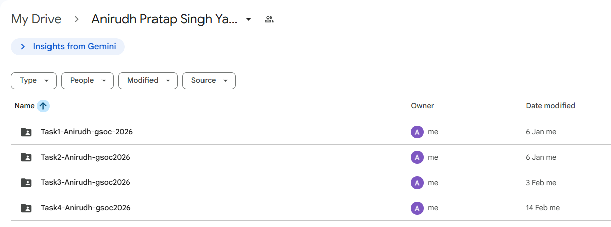
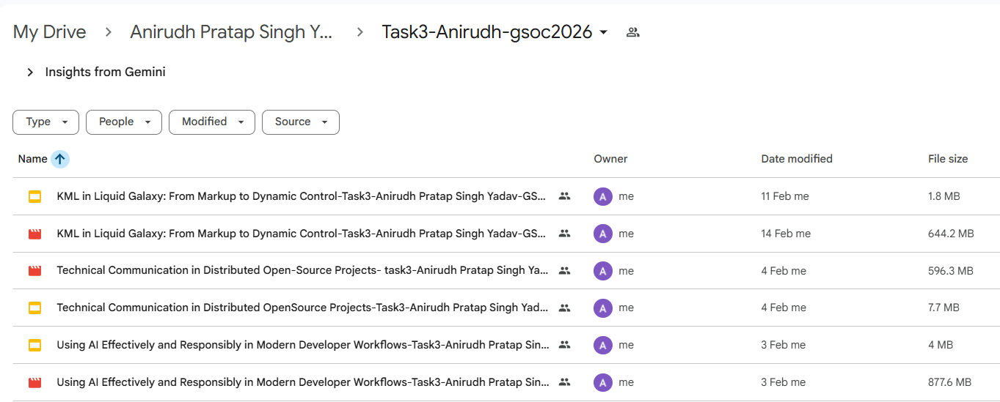
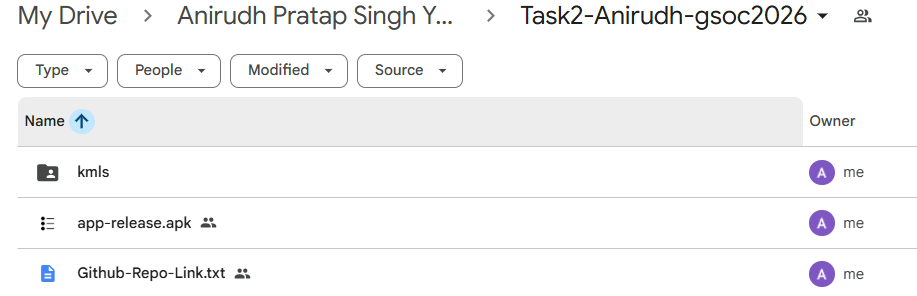

---
title: Standardized Naming Conventions for GSoC Task Submissions
contributor: Anirudh Pratap Singh Yadav
date: March 25, 2026
---

_Contributor Onboarding & Submission Technique_

The Problem
-----------

During the GSoC prerequisite phase, Liquid Galaxy mentors evaluate hundreds of submissions from global contributors. A frequent error among new applicants is uploading files with vague or disorganized titles,such as: `final_task.pdf`, `my_video.mp4`, `kml_file_1.kml`, or filenames containing spaces.

Generic naming hinders the ability of mentors to efficiently track and organize a contributor’s progress. This entry establishes the mandatory directory architecture and naming standards required for a successful submission.

The Required Directory Architecture
-----------------------------------

To ensure your work is reviewed correctly, you must implement a strict hierarchical folder structure within your Google Drive.

**Step 1: The Main Root Folder** Create one master repository folder for all your tasks. This folder must be titled with your full name and the current GSoC cycle year.

*   **Format:** \[Your Full Name\]-GSOC-\[Year\]
*   **Example:** Anirudh Pratap Singh Yadav-GSOC-2026

**Step 2: Task-Specific Subfolders** Within your master folder, create a dedicated subfolder for every individual task. This prevents the overlapping or mixing of different task files.

*   **Format:** Task\[Number\]-\[First Name\]-gsoc\[Year\]
*   **Example:** Task1-Anirudh-gsoc2026

**Step 3: Individual File Naming** Upload your deliverables into their respective task folders. Whether submitting a KML, MP4, PDF, or APK, every file must follow the project’s strict naming convention,strictly avoiding the use of spaces.

*   **Format:** (Refer to the specific task post for the required string)
*   **Example (presentation):** presentationname-YourName-GSOC2026

### Important Note on Code Submissions

When submitting source code for Flutter applications, do not upload raw code files directly to Google Drive. Instead, push your code to a public GitHub repository. You must then upload a properly named Google Doc or .txt file containing the direct hyperlink to your repository into your Task folder.

*   **Example:** Github-Repo-Link.txt (Standard for Task 2)

