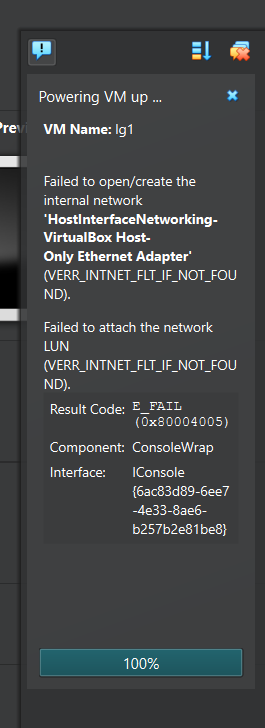

---
title: "TROUBLESHOOTING GUIDE\: VirtualBox failed to open or create Host Only Ethernet Adapter"
contributor: Debanjan Naskar
date: March 17, 2025
---
## Overview
After sudden updates from Windows you can face such a problem when you try to connect with a Host Only Adapter necessary for the proper functioning of your Liquid Galaxy System and connect it to other devices via SSH. In such a scenario even reinstalling VirtualBox does not tend to work.  If something similar happens in your system you can make your Host Only Network again function correctly using these steps:

*   Close Virtual Box
*   Check the task manager for any running interfaces of VirtualBox
*   End Task them and then uninstall VirtualBox
*   Next download and run the VirtualBox installer as admin
*   Run the Virtual Box as admin after installation completes
*   Create host only network
*   Type “View Network Connections” your search bar and tap into it
*   A Control Panel windows opens 
*   Locate your VirtualBox Host Only Adapters
*   Next right click on it
*   Next Disable and then Enable the Adapter 
*   Now run the VM and everything should work fine.

This is how you can troubleshoot your Host Only Adapter errors in VirtualBox.
