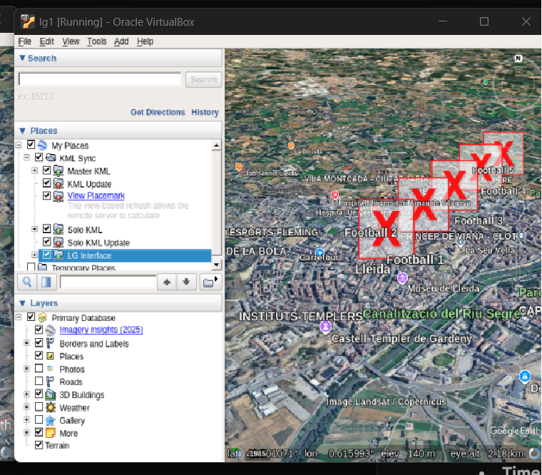

### The Problem

A frequent issue occurs when contributors add custom `<Icon>` markers, `<ScreenOverlay>` logos, or `<GroundOverlay>` images to their KMLs—particularly when generating them dynamically from a Flutter app in Android Studio.

The Liquid Galaxy Master node successfully receives the command and navigates to the correct coordinates, but instead of displaying the custom image, Google Earth renders a large **red "X"** inside a square box.

### The Root Cause

The presence of this red "X" indicates that Google Earth successfully parsed the KML syntax and identified the `<href>` tag, but the operating system could not physically locate the image file across the network. This usually occurs due to pathing conflicts:

1.  **Localhost Confusion:** If your Flutter app writes a KML with a path like `<href>http://localhost:8080/logo.png</href>`, it works on your laptop. However, when the Master node reads the KML, it searches its _own_ internal environment for the file, which does not exist.
2.  **Absolute Local Paths:** If you define a path like `<href>C:/Users/Desktop/assets/logo.png</href>`, the Linux-based Master node will fail to resolve it because Linux does not recognize the Windows C-drive file structure.

* * *

Solutions
---------

### Method A: Hosted Absolute IPv4 Paths (For Dynamic Apps)

If you are running a local HTTP server (such as Express or Python’s `http.server`) to serve KMLs from your laptop to the rig, you must use your machine's actual **IPv4 address** on the local network. This ensures the Master node knows exactly which machine on the network to request the image from.

*   **Incorrect:** `<href>http://localhost:81/football.png</href>`
*   **Correct:** `<href>http://192.168.1.5:81/football.png</href>` _(Note: Replace with your actual assigned IP)._

### Method B: KMZ Packaging (For Static Assets)

If you are not dynamically hosting images on a live server, you cannot send a standalone `.kml` file. You must bundle the KML code and the image folder together into a `.kmz` archive.

**To do this correctly:**

1.  Place your `doc.kml` file and your `images` folder in the same directory.
2.  Inside your KML, use a clean **relative path**: `<href>images/football.png</href>`.
3.  Select both the `doc.kml` file and the `images` folder, right-click, and compress them directly into a `.zip` file.
    *   _Note: Do not zip the parent folder, or the root path will break._
4.  Rename the `.zip` extension to `.kmz`.

When the rig opens this package, it unpacks the assets locally and resolves the "Red X" automatically.
